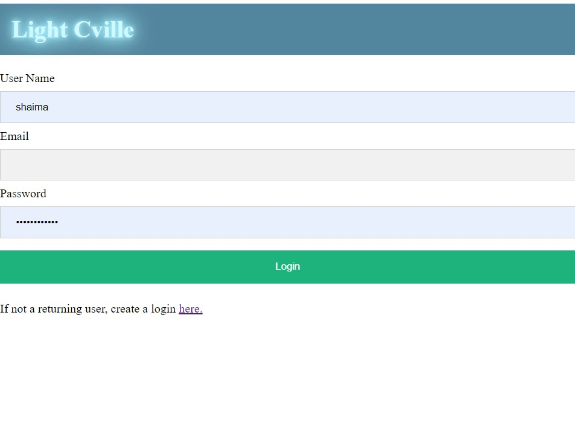
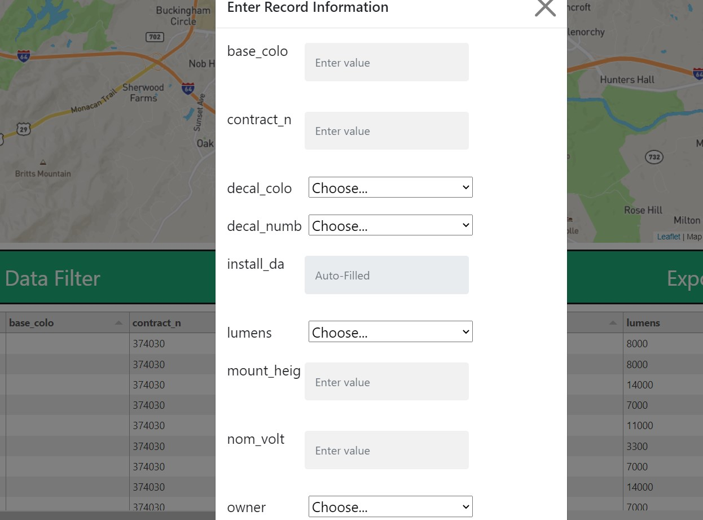

# Project 2: Light Cville
## License
 

<!-- TABLE OF CONTENTS -->

  
Table of Contents

  <ul>
    <li>
      <ul>
       <li><a href="#VIEW LIVE APPLICATION">VIEW LIVE APPLICATION</a></li>
       <li><a href="#INSTALLATION">INSTALLATION</a></li>
        <li><a href="#PROJECT SUMMARY">PROJECT SUMMARY</a></li>
        <li><a href="#USER STORY">USER STORY</a></li>
        <li><a href="#NEW TECH">NEW TECH</a></li>
          <li><a href="#BUILT WITH">BUILT WITH</a></li>
           <li><a href="#SCREEN SHOTS">SCREEN SHOTS</a></li>
        <li><a href="#CONTRIBUTION AND ROLES">CONTRIBUTION ANS ROLES</a></li>
      </ul>
    </li>
    </ul>

## VIEW LIVE APPLICATION 

## INSTALLATION
To run this app 

## PROJECT SUMMARY: 
Streetlights have a profound impact on the vitality of a city. Good street lighting reduces crime, increases night-time economic activity, and prevents auto accidents. The streetlight network is one of the most large-scale and expensive components of a city’s public infrastructure, and streetlights are a major contributor to a city’s electricity use and carbon footprint.
That raises an important question: how should the city make decisions about how to replace and expand the streetlight network? And what criteria should be used to make these decisions? The lights use a significant amount of energy, so lights can be replaced with energy-efficient bulbs to reduce the city’s carbon footprint. The network can be expanded to bring more light to underserved neighborhoods. Light pollution can be taken into account. And decisions can be made to reduce the cost to city in the short and longterm.
This project will tackle the problem of wrangling Charlottesville’s various streetlight data to build a tool that maps the streetlights and displays all the information the city would need to know about each individual streetlight in an intuitive application. This application will allow the city to view streetlight data both in a tabular and spatial manner. The city will be able to better manage their streetlight data.

## USER STORY: 
•	As a… City of Charlottesville employee
• I should be able to Login or creat an account ,
•	I want to… View and modify data about the streetlights in the City of Charlottesville
•	So that… the city can make better informed decisions about maintenance, future development, etc.

## NEW TECH:
•	Mapping library (leaflet, google maps api, openlayers, etc)

•	Tabular view of data (tabulator, bootstrap tables)

 ## BUILT WITH 
  •  Node js

  •	 mySQL

  •	 npm

  •  MVC

 ## SCREEN SHOTS

## CONTRIBUTIONS AND ROLES:

•   Erich Purpur: Back End and support [Github](https://github.com/epurpur)

•	Shaima Jobran: Back End and Front End [Github](https://github.com/shaimajobran)

•	Christopher Zacharias: Front End [Github](https://github.com/ChrisZ304)

•	Jordan Koenig : [Github](https://github.com/jordankoenig)

